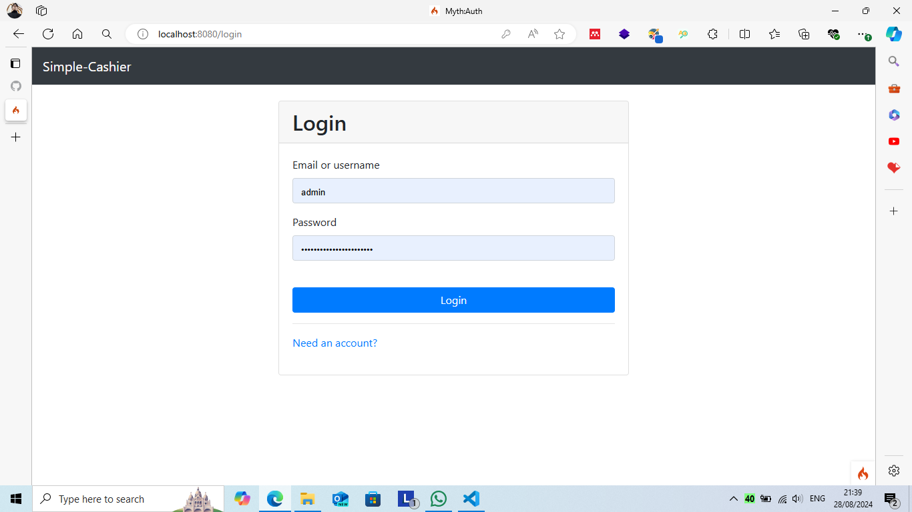
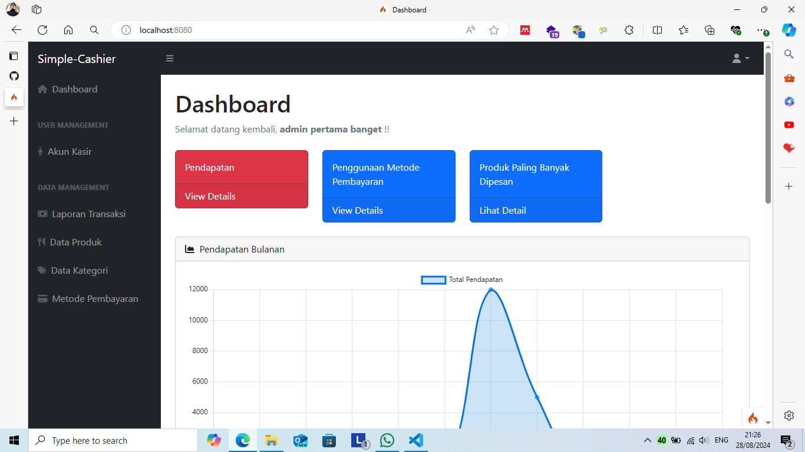
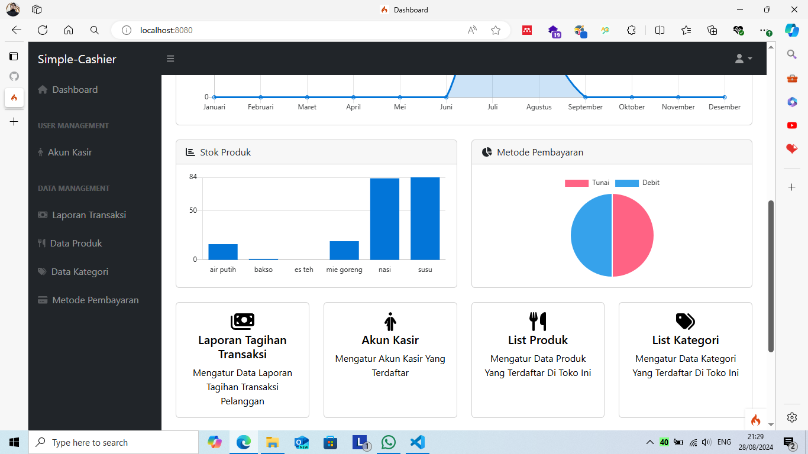
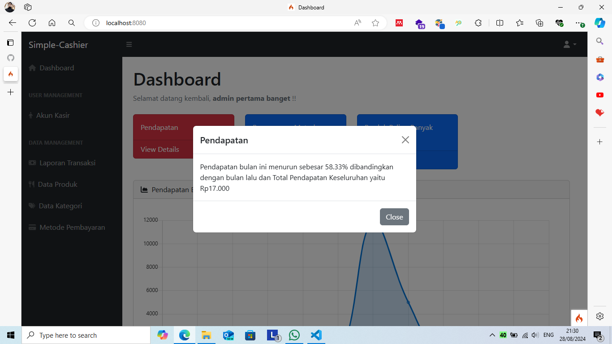
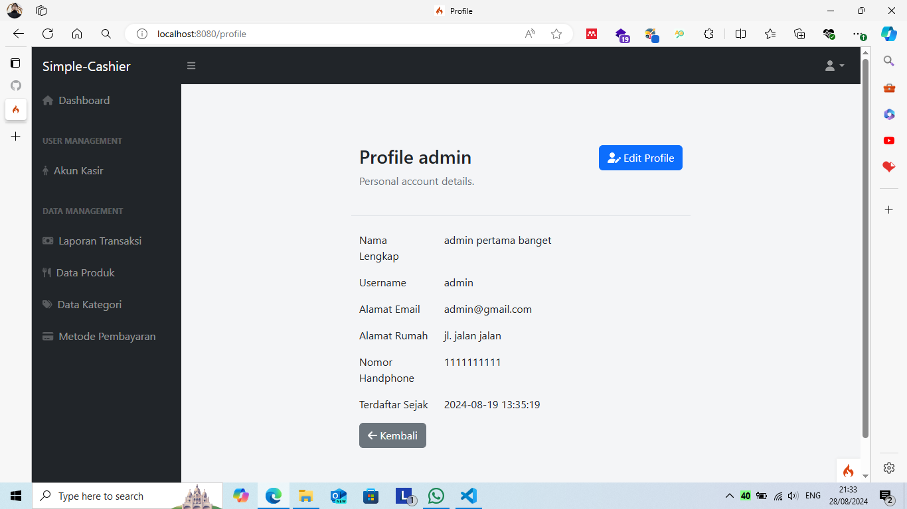
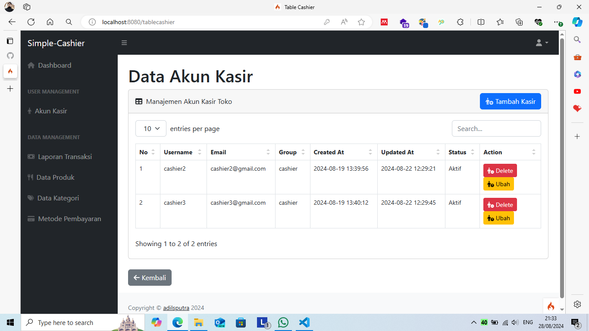
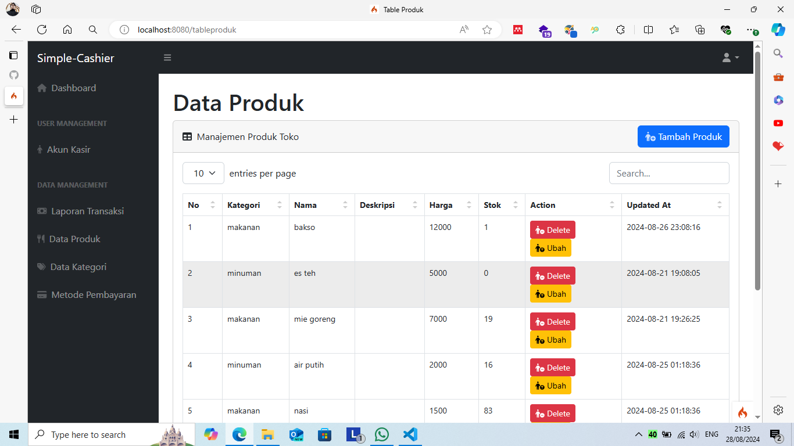
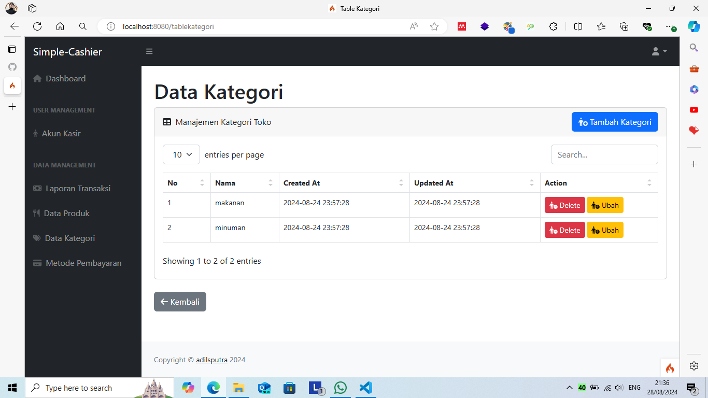

# APLIKASI SIMPLE-CASHIER

Jika Anda merasa repositori ini bermanfaat dan ingin menggunakannya, silakan pertimbangkan untuk memberikan bintang. Ini akan menunjukkan dukungan Anda terhadap repositori ini dan membantu orang lain menemukannya.

Open this [`README.md`](https://github.com/ImperFecti/simple-cashier/blob/master/README_EN.md) in english version.

## Persyaratan Pengembangan Situs Web Ini

Berikut adalah apa yang perlu Anda unduh untuk pertama kali jika Anda ingin mengembangkan situs web ini dengan source code terbaru saya:

- [Composer 2.7.5](https://getcomposer.org/)
- [CodeIgniter 4 4.5.4](https://github.com/codeigniter4/CodeIgniter4/releases/tag/v4.5.4)
- [XAMPP 8.2.12 Windows](https://sourceforge.net/projects/xampp/files/XAMPP%20Windows/8.2.12/)
- [Git](https://git-scm.com/downloads)

## Fitur

- Login untuk admin dan kasir
- Kasir dapat membuat tagihan, melihat list tagihan, melihat detail tagihan dan melihat stok produk
- Admin dapat melakukan semua kegiatan kasir, menghapus dan mengubah data produk, mengelola akun kasir dan dapat membuat akun untuk kasir
- Admin dapat menambahkan atau mengubah data metode pembayaran
- Tampilan website responsif

## Apa yang Saya Gunakan dalam Situs Web Ini ?

- CodeIgniter 4 v4.5.4
- Template SB Admin Bootstrap
- Myth/Auth v1.2.1

## Pengaturan

- Pastikan bahwa Anda sudah menginstal semua persyaratan pengembangan situs web di atas.
- [<b>Download](https://github.com/ImperFecti/simple-cashier/archive/refs/heads/master.zip) file proyek ini </b> dan ekstrak di mana pun Anda inginkan.
  -Atau Anda dapat menggunakan <b>git</b> dengan `git bash here` ke folder yang ditentukan dan mulai mengkloning repositori ini dengan perintah ini `git clone https://github.com/ImperFecti/simple-cashier.git`.
- Salin dan tempel file `env` lalu tempelkan kode ini untuk mengatur database:

```
# ENVIRONMENT

CI_ENVIRONMENT = development

# APP

app.baseURL = 'http://localhost:8080'
# If you have trouble with `.`, you could also use `_`.
# app_baseURL = ''
# app.forceGlobalSecureRequests = false
# app.CSPEnabled = false

# DATABASE

database.default.hostname = localhost
database.default.database = simple-cashier
database.default.username = root
database.default.password =
database.default.DBDriver = MySQLi
database.default.DBPrefix =
database.default.port = 3306
```

- Untuk mengimpor database, buka [`phpmyadmin`](http://localhost/phpmyadmin) dan buat database baru dengan nama `bayarlistrik`.
- Di [`phpmyadmin`](http://localhost/phpmyadmin), pilih database `bayarlistrik` yang Anda buat dan kemudian pilih impor.
- Impor database bernama `bayarlistrik.sql` di dalam file direktori `APPPATH\app\Database`.
- itus web ini saat ini menggunakan [`http://localhost:8080/`](http://localhost:8080/) dari spark. Untuk memulai localhost dengan [spark](https://codeigniter.com/user_guide/cli/spark_commands.html), jalankan perintah ini `php spark serve` dari terminal Anda untuk mengaktifkan localhost.
- Jika Anda ingin mengembangkan situs web ini menggunakan XAMPP, Anda dapat mengubah <b>baseURL</b> di `App.php` dan pastikan file proyek disimpan di `htdocs`.

## Akun Admin

Jika Anda menggunakan database yang telah saya sediakan, Anda dapat menggunakan akun admin yang telah terdaftar di bawah ini:

- Username `admin` password `letslogintoadminaccount`
- Username `admin2` password `letslogintoadminaccount`
- Username `cashier2` password `letslogintocashieraccount`
- Username `cashier3` password `letslogintocashieraccount`

## Pengaturan Library Myth\Auth

- Jalankan `composer update` dari terminal untuk memperbarui dependensi dengan <b>composer</b>.
- Setelah pembaruan selesai, Anda dapat menemukan folder bernama `myth\auth` di dalam `APPPATH\app\Vendor` dan mulai mengatur pustaka ini.
- Jika Anda tidak dapat menemukan pustaka di dalam `Vendor`, coba jalankan perintah ini di dalam terminal.

```
composer require myth/auth
```

- Temukan `Auth.php` di dalam `Vendor\myth\auth\Config\` dan ubah variabel di bawah ini

### Grup Pengguna Default

Ubah nilai variabel `$defaultUserGroup` menjadi:

```
public $defaultUserGroup = 'cashier';
```

### Views

Ubah nilai variabel `$views` menjadi:

```
public $views = [
    'login'       => 'Myth\Auth\Views\login',
    'register'    => 'Myth\Auth\Views\register',
    'forgot'      => 'Myth\Auth\Views\forgot',
    'reset'       => 'Myth\Auth\Views\reset',
    'emailForgot' => 'Myth\Auth\Views\emails\forgot',
];
```

## Allow User Registration

Ubah nilai variable `$allowRegistration`

```
public $allowRegistration = false;
```

### Allow Password Reset via Email

Ubah nilai variabel `$activeResetter` menjadi:

```
public $activeResetter = null;
```

## Preview

- Login
  

- Dashboard
  

  

  

- Profile
  

- Tabel Kasir
  

- Tabel Transaksi
  

- Bukti Tagihan
  

- Tabel Produk
  

- Tabel Kategori
  

- Tabel Metode Pembayaran
  

## Menemukan masalah saat mengembangkan aplikasi ini?

Buat [issue](https://github.com/ImperFecti/simple-cashier/issues) baru untuk repositori ini atau Anda dapat mencoba menghubungi [email](mailto:adilm8909@gmail.com) / [instagram](https://www.instagram.com/_adilsputra/) / [twitter](https://twitter.com/_adilsputra)

## Ingin berkontribusi pada repositori ini?

Saya menyadari bahwa repositori ini masih belum sempurna dan belum optimal. Jika Anda memiliki ide untuk meningkatkan repositori ini, <b>[Fork](https://github.com/ImperFecti/simple-cashier/fork)</b> halaman repositori ini untuk membuat salinan repositori Anda sendiri di akun GitHub Anda.
