# SIMPLE-CASHIER APPLICATION

If you find this repository useful and want to use it, please consider giving it a star. This will show your support for this repository and help others find it.

## Development Requirements for This Website

Here's what you need to download first if you want to develop this website with my latest source code:

- [Composer 2.7.5](https://getcomposer.org/)
- [CodeIgniter 4 4.5.4](https://github.com/codeigniter4/CodeIgniter4/releases/tag/v4.5.4)
- [XAMPP 8.2.12 Windows](https://sourceforge.net/projects/xampp/files/XAMPP%20Windows/8.2.12/)
- [Git](https://git-scm.com/downloads)

## Features

- Login for admin and cashier
- Cashier can create bills, view bill list, view bill details, and check product stock
- Admin can perform all cashier activities, delete and modify product data, manage cashier accounts, and create accounts for cashiers
- Admin can add or modify payment method data
- Responsive website design

## What I Use in This Website

- CodeIgniter 4 v4.5.4
- SB Admin Bootstrap Template
- Myth/Auth v1.2.1

## Setup

- Make sure you have installed all the website development requirements mentioned above.
- [<b>Download</b>](https://github.com/ImperFecti/simple-cashier/archive/refs/heads/master.zip) this project file and extract it wherever you want.
  - Or you can use <b>git</b> with `git bash here` to the specified folder and start cloning this repository with this command `git clone https://github.com/ImperFecti/simple-cashier.git`.
- Copy and paste the `env` file then paste this code to set up the database:

```
# ENVIRONMENT

CI_ENVIRONMENT = development

# APP

app.baseURL = 'http://localhost:8080'
# If you have trouble with `.`, you could also use `_`.
# app_baseURL = ''
# app.forceGlobalSecureRequests = false
# app.CSPEnabled = false

# DATABASE

database.default.hostname = localhost
database.default.database = simple-cashier
database.default.username = root
database.default.password =
database.default.DBDriver = MySQLi
database.default.DBPrefix =
database.default.port = 3306
```

- To import the database, open [`phpmyadmin`](http://localhost/phpmyadmin) and create a new database named `bayarlistrik`.
- In [`phpmyadmin`](http://localhost/phpmyadmin), select the `bayarlistrik` database you created and then choose import.
- Import the database named `bayarlistrik.sql` inside the `APPPATH\app\Database` directory file.
- This website currently uses [`http://localhost:8080/`](http://localhost:8080/) from spark. To start localhost with [spark](https://codeigniter.com/user_guide/cli/spark_commands.html), run this command `php spark serve` from your terminal to activate localhost.
- If you want to develop this website using XAMPP, you can change the <b>baseURL</b> in `App.php` and make sure the project file is saved in `htdocs`.

## Admin Account

If you use the database I have provided, you can use the admin account that has been registered below:

- Username `admin` password `letslogintoadminaccount`
- Username `admin2` password `letslogintoadminaccount`
- Username `cashier2` password `letslogintocashieraccount`
- Username `cashier3` password `letslogintocashieraccount`

## Myth\Auth Library Setup

- Run `composer update` from the terminal to update dependencies with <b>composer</b>.
- After the update is complete, you can find a folder named `myth\auth` inside `APPPATH\app\Vendor` and start setting up this library.
- If you can't find the library inside `Vendor`, try running this command inside the terminal.

```
composer require myth/auth
```

- Find `Auth.php` inside `Vendor\myth\auth\Config\` and change the variables below

### Default User Groups

Change the value of the `$defaultUserGroup` variable to:

```
public $defaultUserGroup = 'cashier';
```

### Views

Change the value of the `$views` variable to:

```
public $views = [
    'login'       => 'Myth\Auth\Views\login',
    'register'    => 'Myth\Auth\Views\register',
    'forgot'      => 'Myth\Auth\Views\forgot',
    'reset'       => 'Myth\Auth\Views\reset',
    'emailForgot' => 'Myth\Auth\Views\emails\forgot',
];
```

## Allow User Registration

Change the value of the `$allowRegistration` variable

```
public $allowRegistration = false;
```

### Allow Password Reset via Email

Change the value of the `$activeResetter` variable to:

```
public $activeResetter = null;
```

## Preview

- Login
  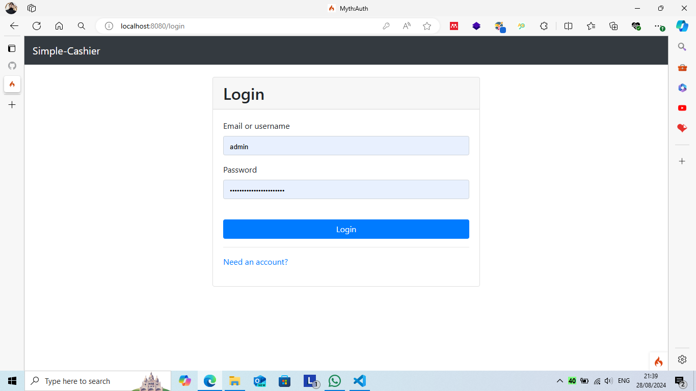

- Dashboard
  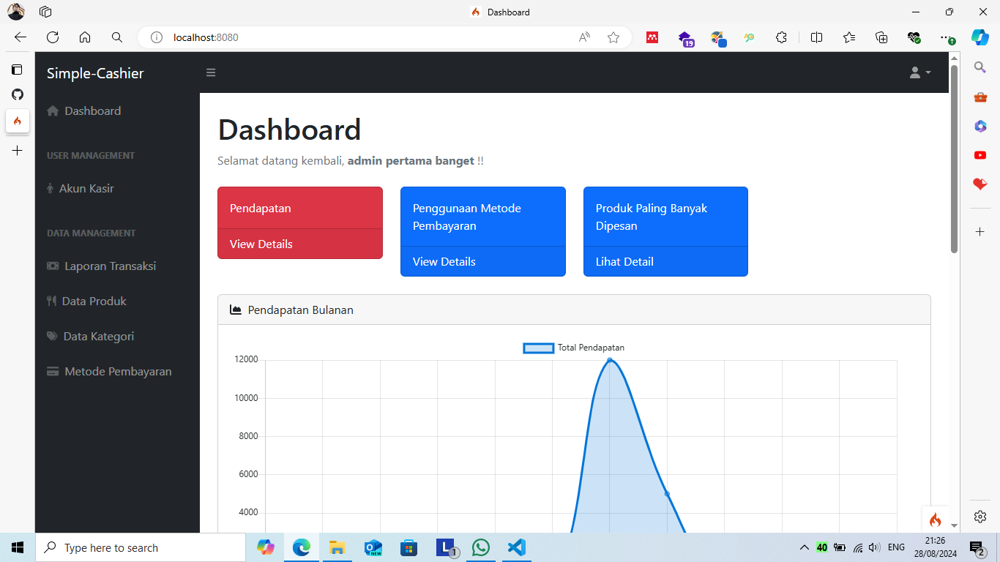

  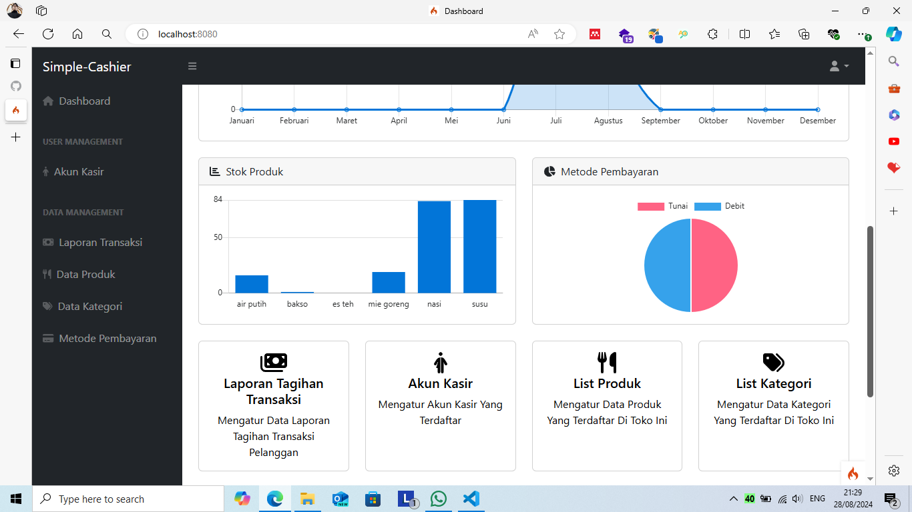

  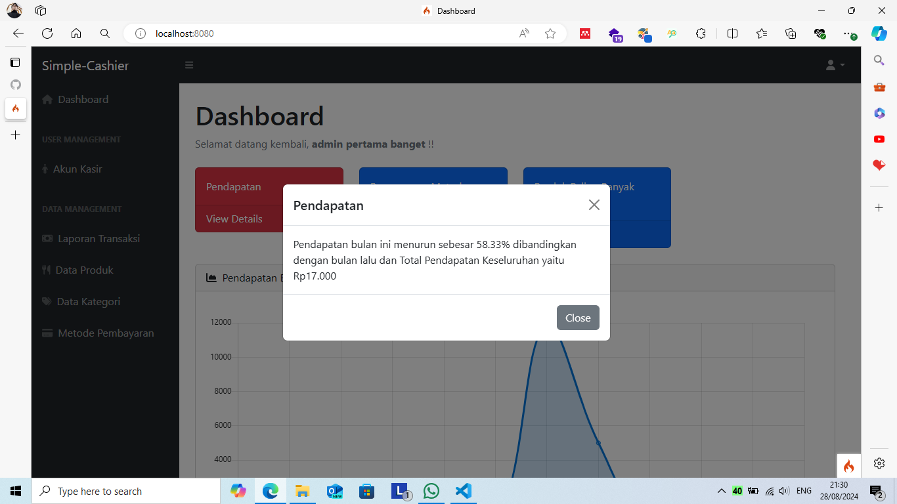

- Profile
  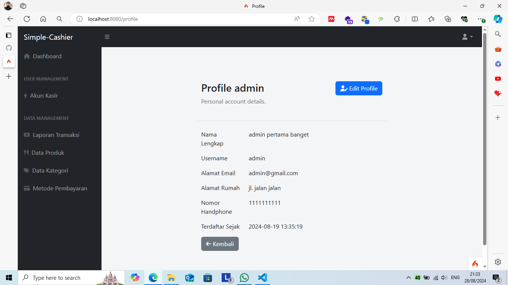

- Tabel Kasir
  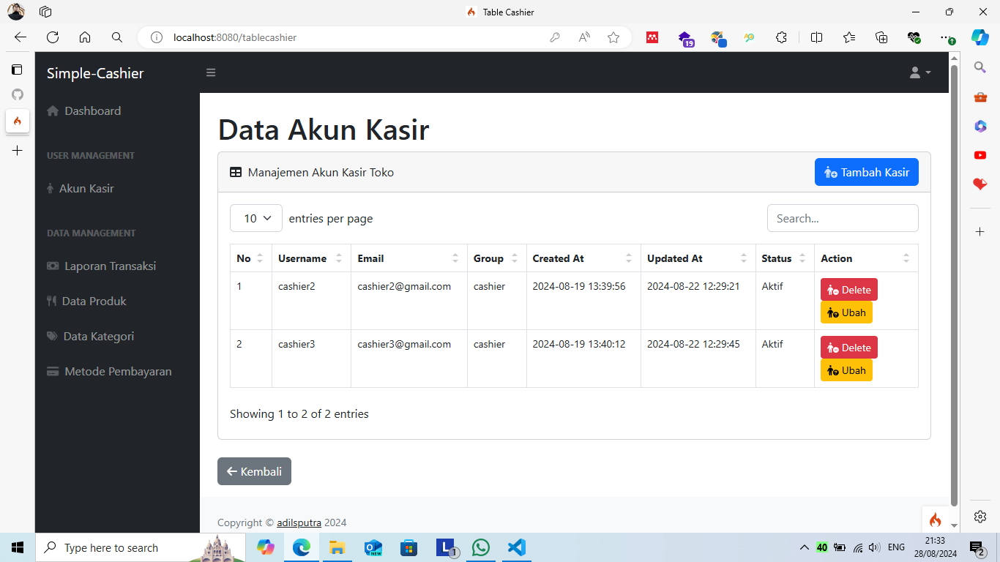

- Tabel Transaksi
  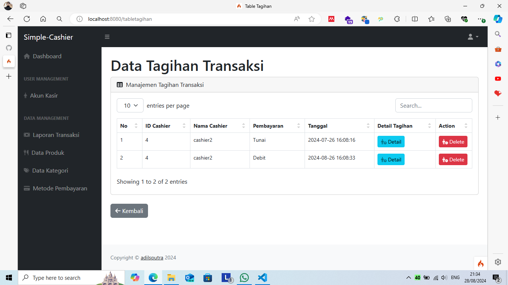

- Bukti Tagihan
  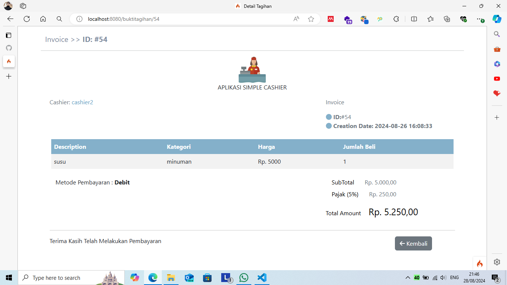

- Tabel Produk
  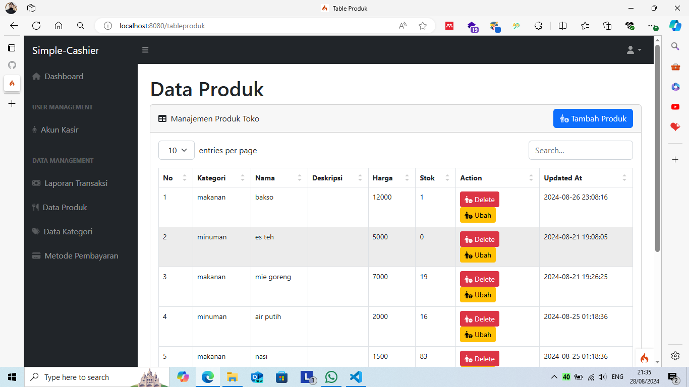

- Tabel Kategori
  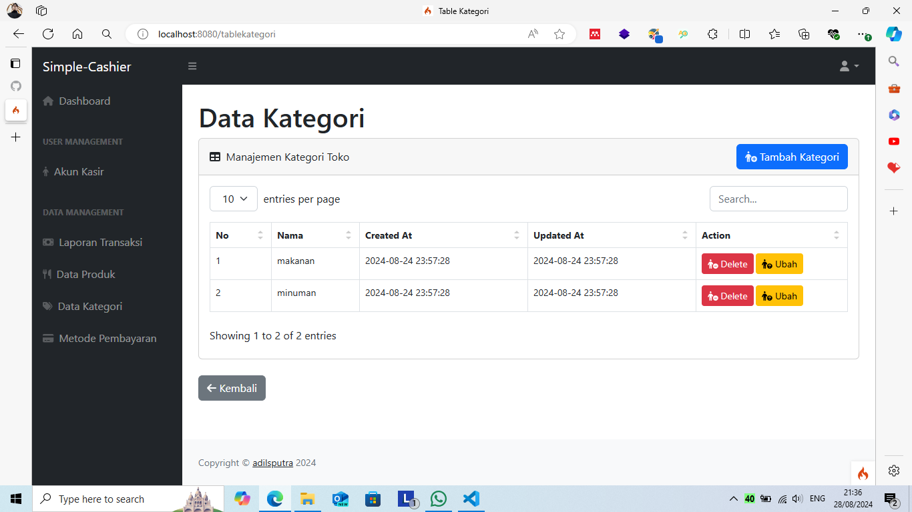

- Tabel Metode Pembayaran
  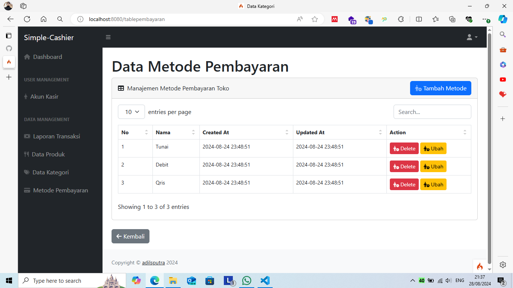

## Finding issues while developing this application?

Create a new [issue](https://github.com/ImperFecti/simple-cashier/issues) for this repository or you can try contacting [email](mailto:adilm8909@gmail.com) / [instagram](https://www.instagram.com/_adilsputra/) / [twitter](https://twitter.com/_adilsputra)

## Want to contribute to this repository?

I realize that this repository is still not perfect and not optimal. If you have ideas to improve this repository, <b>[Fork](https://github.com/ImperFecti/simple-cashier/fork)</b> this repository page to create your own copy of the repository in your GitHub account.
